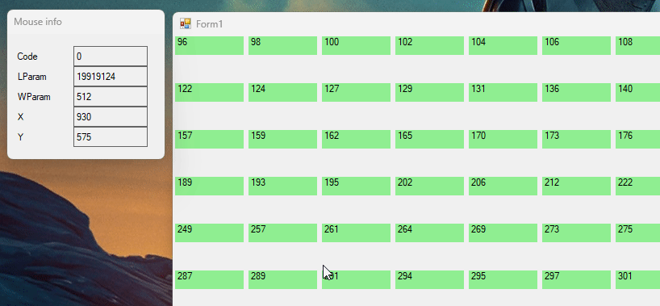
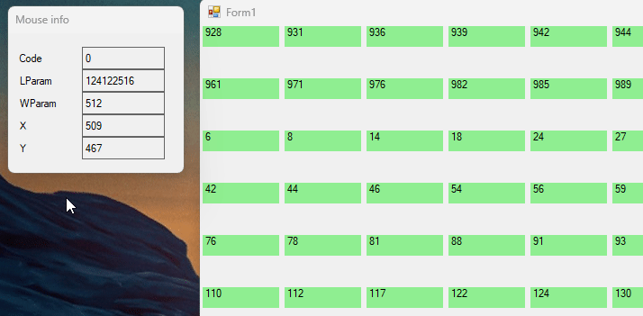

# Windows Global Mouse Hook test

Using the syscall [SetWindowsHookEx](https://learn.microsoft.com/en-us/windows/win32/api/winuser/nf-winuser-setwindowshookexa) on the Global Mouse Hook can result in a lagging feedback on the mouse pointer. A solution to this can be handling the hook in a background thread on which we've started a message pump using the [ApplicationContext](https://learn.microsoft.com/en-us/dotnet/api/system.windows.forms.applicationcontext?redirectedfrom=MSDN&view=netframework-4.8) class.

You can switch between the two versions using the `-cc` parameter.

Before:

After:

